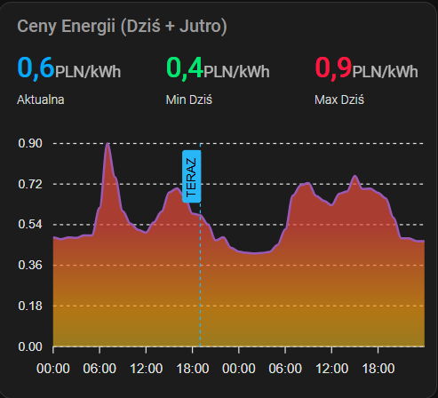

# ⚡ Energy Hub Poland
## Twój inteligentny asystent kosztów energii w Home Assistant


[](https://my.home-assistant.io/redirect/hacs_repository/?owner=AllonGit&repository=energy_hub_poland&category=integration)

**For the English version click [here](README_EN.md)**

<p align="center">
  
</p>

---

**Energy Hub Poland** to zaawansowana integracja dla Home Assistant, zaprojektowana specjalnie dla polskiego rynku energii. Pozwala na monitorowanie cen prądu, analizę kosztów oraz optymalizację zużycia energii w oparciu o rzeczywiste taryfy (w tym dynamiczne RCE).

Unikalną cechą jest **Tryb Porównania**, który analizuje Twoje zużycie i podpowiada, która taryfa byłaby dla Ciebie najbardziej opłacalna.

## 🌟 Możliwości i Tryby Pracy

Integracja obsługuje cztery główne tryby operacyjne:

### 1. 📉 Tryb Dynamiczny (RCE)
Pobiera godzinowe stawki rynkowe bezpośrednio z PSE/TGE.
* Idealny dla prosumentów na zasadach net-billing.
* Prezentuje ceny netto (bez VAT i opłat dystrybucyjnych).

### 2. 🏠 Tryb G12
Klasyczna taryfa dwustrefowa zdefiniowana przez użytkownika.
* Możliwość ręcznego wprowadzania godzin szczytowych (np. `6-13,15-22`).
* Śledzenie kosztów w strefie drogiej i taniej.

### 3. 🏖️ Tryb G12w (Weekendowy)
Rozszerzona taryfa dwustrefowa, uwzględniająca polski kalendarz świąt.
* Automatycznie traktuje **soboty, niedziele oraz polskie święta ustawowe** jako strefę pozaszczytową (tanią).
* Wykorzystuje bibliotekę `holidays` do precyzyjnego wykrywania dni wolnych od pracy w Polsce.

### 4. 📊 Tryb Porównania (Eksperymentalny)
Najpotężniejsza funkcja integracji.
* Oblicza koszty zużycia energii dla **wszystkich trzech taryf jednocześnie** w czasie rzeczywistym.
* Wskazuje potencjalne oszczędności przy zmianie taryfy.
* Wymaga podłączenia licznika energii (encyja `kWh`, typ `total_increasing`).

---

## 🚀 Instalacja

### Krok 1: Instalacja przez HACS

1. Otwórz **HACS** w Home Assistant.
2. Wyszukaj `Energy Hub Poland`
3. Kliknij **Pobierz**.
4. **Zrestartuj Home Assistant**.

### Krok 2: Konfiguracja

1. Przejdź do **Ustawienia** -> **Urządzenia i usługi**.
2. Kliknij przycisk **Dodaj integrację**.
3. Wyszukaj **Energy Hub Poland**.
4. Postępuj zgodnie z kreatorem konfiguracji:
   * Wybierz domyślny tryb pracy.
   * Wprowadź swój licznik energii (wymagany do obliczania kosztów).
   * Zdefiniuj godziny szczytu (jeśli używasz G12).

---

## 🚀 Nowe Sensory i Automatyzacje

W wersji v1.2.1 wprowadziliśmy sensory ułatwiające automatyzację domu:

* **Średnia cena dobowa**: Porównuj aktualną cenę z przeciętną ceną dnia (`dziś` i `jutro`).
* **Godzina najniższej ceny**: Zaplanuj zmywarkę lub pranie na konkretną godzinę.
* **Skok ceny (Binary Sensor)**: Włącza się automatycznie, gdy cena jest o **30% wyższa** od średniej dobowej. Idealne do wyłączania energochłonnych urządzeń (np. bojlera) w szczycie cenowym.

---

## 💡 Przykłady Użycia

Oto jak możesz wykorzystać Energy Hub Poland w swoich automatyzacjach:

* **Inteligentne ładowanie:** Uruchom ładowarkę EV tylko wtedy, gdy cena w taryfie dynamicznej spadnie poniżej ustalonego progu.
* **Powiadomienia o oszczędnościach:** Otrzymuj powiadomienie na koniec miesiąca z informacją z Trybu Porównania: *"Gdybyś używał taryfy G12w, zaoszczędziłbyś 50 PLN w tym miesiącu"*.
* **Kolorowe oświetlenie:** Zmień kolor lampy w salonie na czerwony, gdy aktualna cena energii jest w najdroższym przedziale dnia.

---

## 📈 Wizualizacja - ApexCharts

<p align="center">
  
</p>

Aby zwizualizować ceny dynamiczne (RCE) na wykresie, zalecamy użycie karty **ApexCharts**. Poniżej znajduje się gotowy kod konfiguracyjny.

**Instrukcja:**
1. Upewnij się, że masz zainstalowany dodatek [ApexCharts Card](https://github.com/RomRider/apexcharts-card) z HACS.
2. Dodaj nową kartę "Manual" na swoim dashboardzie Lovelace.
3. Wklej poniższy kod:

```yaml
type: custom:apexcharts-card
experimental:
  color_threshold: true
header:
  show: true
  title: Ceny Energii (Dziś + Jutro)
  show_states: true
  colorize_states: true
  standard_format: false
now:
  show: true
  label: TERAZ
  color: "#29B6F6"
graph_span: 48h
span:
  start: day
yaxis:
  - min: 0
    decimals: 2
    apex_config:
      forceNiceScale: true
apex_config:
  stroke:
    curve: smooth
    width: 2
  xaxis:
    labels:
      format: HH:mm
  annotations:
    xaxis:
      - x: <%= new Date().setHours(24,0,0,0) %>
        strokeDashArray: 4
        borderColor: "#e74c3c"
        borderWidth: 2
        label:
          text: JUTRO
          style:
            color: "#fff"
            background: "#e74c3c"
series:
  - entity: sensor.energy_hub_poland_energy_hub_poland_cena_dynamic
    name: Aktualna
    color: "#03A9F4"
    show:
      in_header: true
      in_chart: false
  - entity: sensor.energy_hub_poland_energy_hub_poland_cena_minimalna_dzis
    name: Min Dziś
    color: "#00E676"
    show:
      in_header: true
      in_chart: false
  - entity: sensor.energy_hub_poland_energy_hub_poland_cena_maksymalna_dzis
    name: Max Dziś
    color: "#FF1744"
    show:
      in_header: true
      in_chart: false
  - entity: sensor.energy_hub_poland_energy_hub_poland_cena_dynamic
    name: Cena
    type: area
    show:
      in_header: false
    color_threshold:
      - value: 0
        color: "#2ecc71"
      - value: 0.5
        color: "#f39c12"
      - value: 0.7
        color: "#e74c3c"
    data_generator: |
      if (!entity.attributes.today_prices) return [];
      const data = [];
      const startTs = new Date().setHours(0, 0, 0, 0);
      for (const [h, p] of Object.entries(entity.attributes.today_prices)) {
        data.push([startTs + (parseInt(h) * 3600000), p]);
      }
      const tom = entity.attributes.tomorrow_prices || {};
      for (const [h, p] of Object.entries(tom)) {
        data.push([startTs + 86400000 + (parseInt(h) * 3600000), p]);
      }
      return data;
```

## ⚡ Integracja z Panelem Energia
Aby Home Assistant poprawnie liczył koszty w oficjalnym panelu Energia:

1. Przejdź do Ustawienia -> Pulpity nawigacyjne -> Energia.

2. W sekcji Zużycie sieci, edytuj swoje źródło energii (licznik).

3. W polu Użyj encji z aktualną ceną wybierz: sensor.energy_hub_current_price.

4. Zapisz zmiany.

<details>
<summary>🗺️ Roadmap</summary>

🟢 Wersja 1.2.2 (W przygotowaniu)
Obsługa Taryfy G11: Dodanie podstawowej taryfy jednostrefowej do Trybu Porównawczego.

🟡 Wersja 1.3.0
Oficjalne API PSE: Pełne przejście na nowe źródła danych Polskich Sieci Elektroenergetycznych.

Wybór Operatora: Automatyczne doliczanie stawek dystrybucyjnych dla największych OSD (PGE, Tauron, Enea).

</details>

## 📖 Dokumentacja i Pomoc
Więcej szczegółów znajdziesz w dokumentacji:

🛠️ [Pełna instrukcja konfiguracji](docs/setup.md) – szczegółowy opis parametrów i opcji.

🔧 [Rozwiązywanie problemów](docs/troubleshooting.md) – najczęstsze błędy i sposoby ich naprawy.

🐛 [Zgłaszanie błędów](https://github.com/AllonGit/energy_hub_poland/issues) – jeśli znajdziesz błąd, zgłoś go tutaj.

💬 [Dyskusje](https://github.com/AllonGit/energy_hub_poland/discussions) – masz pomysł na nową funkcję? Napisz!

## 🏅 Podziękowania

Projekt rozwija się dzięki zaangażowaniu społeczności. Szczególne podziękowania dla:

* **[@abnvle](https://github.com/abnvle)** – za zaprojektowanie i wdrożenie kompleksowej architektury testowej (ponad 1500 linii kodu!). Twój wkład fundamentalnie podniósł stabilność i profesjonalizm tego repozytorium.

## ⚖️ Licencja i Nota Prawna
Ten projekt jest licencjonowany na podstawie licencji **Apache 2.0**.

**Ograniczenie użytku komercyjnego:** Unikalna logika porównywania taryf (Comparison Mode) oraz algorytmy rekomendacji są udostępniane wyłącznie do użytku prywatnego i niekomercyjnego. Wykorzystywanie tych konkretnych modułów w produktach komercyjnych bez zgody autora jest zabronione.

Autorem integracji jest **AllonGit**. Dane rynkowe (RCE) pochodzą z publicznych API operatorów energetycznych.

*© 2026 AllonGit*
